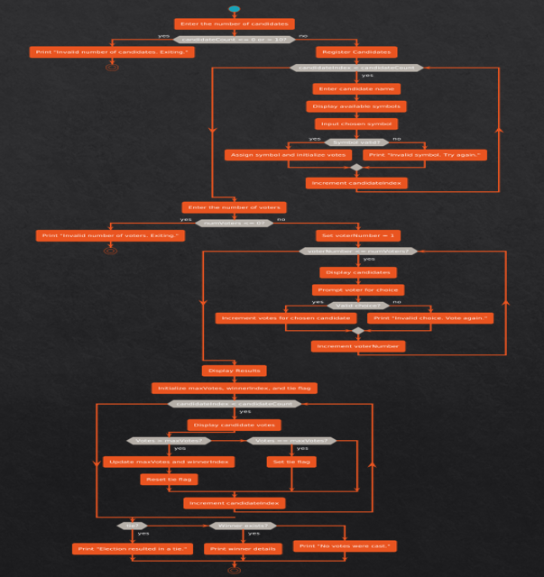

# 🗳️ Voting System in C

A simple **console-based voting system** implemented in C that simulates an election process.  
The program allows candidate registration, secure voting, and result calculation with tie detection.

---

## ✨ Features
- Register up to **10 candidates**
- Unique **symbols assigned** to each candidate
- Accepts votes from multiple voters
- Validates voter input
- Displays **real-time election results**
- Detects **tie conditions**

---

## 🛠️ Technologies Used
- C Programming Language
- Standard Libraries (`stdio.h`, `string.h`)

---

## 🧩 System Workflow



---

## 📂 Project Structure
```
voting-system-c/
├── src/
│ └── voting_system.c
├── README.md
└── screenshots/
```

---

## ▶️ How to Run

### Compile
```bash
gcc src/voting_system.c -o voting
```
## Execute
./voting

## 🧠 What I Learned

- Structs and arrays in C
- Input validation
- Recursive function usage
- Managing state in procedural programs
- Simulating real-world systems using C

## 🚀 Future Improvements

- File-based vote storage
- Admin authentication
- GUI-based interface
- Vote encryption
